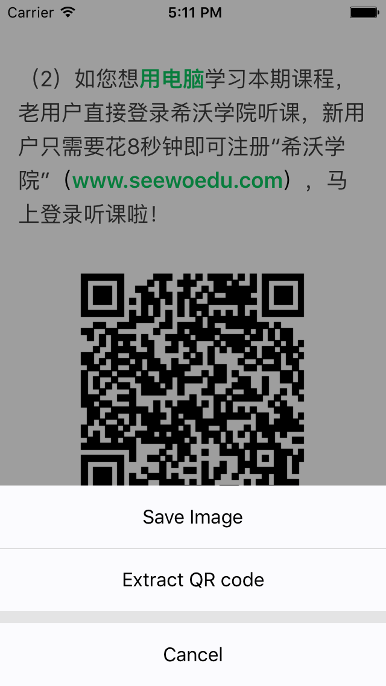
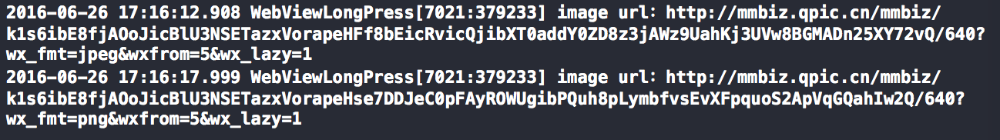
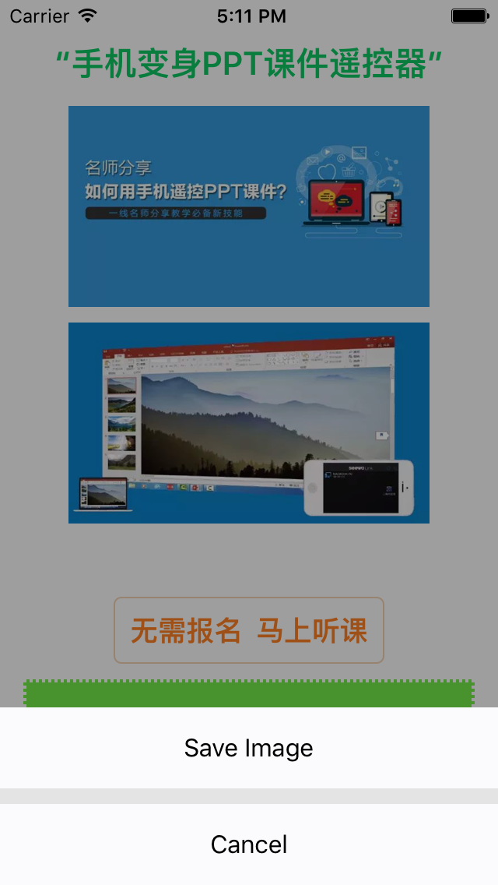

## UIWebView长按保存图片和识别图片二维码的实现方案(使用缓存)
### 0x00 需求：长按识别UIWebView中的二维码，如下图



### 0x01 方案1：
给UIWebView增加一个长按手势，激活长按手势时获取当前UIWebView的截图，分析是否包含二维码。

**核心代码**：略

**优点**：流程简单，可以快速实现。

**不足**：无法实现保存UIWebView中图片，如果当前WebView二维码显示不全或者多个二维码，使用这种方式实现的二维码识别也会有问题；

### 0x02 方案2：
长按UIWebView时，获取手指单击位置的图片的URL地址。这种方案是通过获取手指点击的位置，然后获取该位置的标签的src属性，进而获取到url。

**核心代码**：

```
@interface CVWebViewController ()<UIGestureRecognizerDelegate>

@property (weak, nonatomic) IBOutlet UIWebView *webView;

@end

@implementation CVWebViewController

- (void)viewDidLoad
{
    [self.webView  loadRequest:[NSURLRequest requestWithURL:[NSURL URLWithString:@"http://mp.weixin.qq.com/s?__biz=MzI2ODAzODAzMw==&mid=2650057120&idx=2&sn=c875f7d03ea3823e8dcb3dc4d0cff51d&scene=0#wechat_redirect"]]];
    UILongPressGestureRecognizer *longPressed = [[UILongPressGestureRecognizer alloc] initWithTarget:self action:@selector(longPressed:)];
    longPressed.delegate = self;
    [self.webView addGestureRecognizer:longPressed];
}

- (void)longPressed:(UITapGestureRecognizer*)recognizer
{
    if (recognizer.state != UIGestureRecognizerStateBegan) {
        return;
    }
    CGPoint touchPoint = [recognizer locationInView:self.webView];
    NSString *js = [NSString stringWithFormat:@"document.elementFromPoint(%f, %f).src", touchPoint.x, touchPoint.y];
    NSString *imageUrl = [self.webView stringByEvaluatingJavaScriptFromString:js];
    if (imageUrl.length == 0) {
        return;
    }
    NSLog(@"image url：%@",imageUrl);
    NSData *data = [NSData dataWithContentsOfURL:[NSURL URLWithString:imageUrl]];
    
    UIImage *image = [UIImage imageWithData:data];
    if (image) {
        //......
        //save image or Extract QR code
    }
}

-(BOOL)gestureRecognizer:(UIGestureRecognizer *)gestureRecognizer shouldRecognizeSimultaneouslyWithGestureRecognizer:(UIGestureRecognizer *)otherGestureRecognizer
{
    return YES;
}
```
上述代码实现的核心部分就是

```
NSString *js = [NSString stringWithFormat:@"document.elementFromPoint(%f, %f).src", touchPoint.x, touchPoint.y];
NSString *imageUrl = [self.webView stringByEvaluatingJavaScriptFromString:js];
```
第一行代码是通过js获取点击位置的标签的src属性;

第二行代码是接受向webview注入第一行的js代码后返回的src属性。

如果点击位置是图片，那么久可以通过img.src拿到图片的url地址，如果不是就返回空值。

**效果**：

**注意**：由于UIWebView内部是有一个ScrollView，默认情况下不支持多个手势的，因此需要实现UIGestureRecognizerDelegate中的gestureRecognizer:shouldRecognizeSimultaneouslyWithGestureRecognizer:协议，以支持多个手势（增加长按手势）。

**优点**：通过识别img标签的url属性，既可以实现保存图片的功能，也可以实现识别图片中二维码的功能；该方案不仅仅可以获取img标签的属性，也可以根据需要获取其他标签，例如链接标签\<a>的属性（需调整部分代码，识别tagName）。

**不足**：每次获取图片，都需要根据url获取，相当于从网络获取，万一图片太大或者网络不好，势必会影响用户体验，方案3中会介绍如何从缓存中获取image数据。

### 0x03 方案3：
利用Runtime，动态地为UIWebView注入一段js代码，获取IMG标签的src属性，然后从UIWebView的缓存中获取image数据。

webview加载完成图片完成之后，图片数据已经缓存在webview里了，只需找到从缓存中获取这些数据的方法。

方案3使用的从缓存中获取image数据原理是：使用NSURLProtocol,webview在处理请求的过程中会调用

```
- (NSURLRequest *)connection:(NSURLConnection *)connection willSendRequest:(NSURLRequest *)request redirectResponse:(NSURLResponse *)response
```
NSURLProtocol把webView请求返回来的data用压缩的方式的存储在cache的文件夹下, 发出请求的时候会先去读取缓存。

在github上找到了一个[RNCachingURLProtocol](https://github.com/rnapier/RNCachingURLProtocol),可以方便地从缓存中获取数据。

关于[NSURLProtocol](http://www.jianshu.com/p/7c89b8c5482a)，能够让你去重新定义苹果的URL[加载系统](https://developer.apple.com/library/ios/documentation/Cocoa/Conceptual/URLLoadingSystem/URLLoadingSystem.html#//apple_ref/doc/uid/10000165-BCICJDHA) (URL Loading System)的行为，URL Loading System里有许多类用于处理URL请求，比如NSURL，NSURLRequest，NSURLConnection和NSURLSession等，当URL Loading System使用NSURLRequest去获取资源的时候，它会创建一个NSURLProtocol子类的实例，你不应该直接实例化一个NSURLProtocol，NSURLProtocol看起来像是一个协议，但其实这是一个类，而且必须使用该类的子类，并且需要被注册。

**核心代码**：

```
static NSString *const kTouchJavaScriptString =
        @"document.ontouchstart=function(event){\
            x=event.targetTouches[0].clientX;\
            y=event.targetTouches[0].clientY;\
            document.location=\"myweb:touch:start:\"+x+\":\"+y;};\
        document.ontouchmove=function(event){\
            x=event.targetTouches[0].clientX;\
            y=event.targetTouches[0].clientY;\
            document.location=\"myweb:touch:move:\"+x+\":\"+y;};\
        document.ontouchcancel=function(event){\
            document.location=\"myweb:touch:cancel\";};\
            document.ontouchend=function(event){\
            document.location=\"myweb:touch:end\";};";

static NSString *const kImageJS               = @"keyForImageJS";
static NSString *const kImage                 = @"keyForImage";
static NSString *const kImageQRString         = @"keyForQR";

static const NSTimeInterval KLongGestureInterval = 0.8f;
......
    SwizzlingMethod([self class], @selector(webViewDidStartLoad:), @selector(sl_webViewDidStartLoad:));
    SwizzlingMethod([self class], @selector(webView:shouldStartLoadWithRequest:navigationType:), @selector(sl_webView:shouldStartLoadWithRequest:navigationType:));
    SwizzlingMethod([self class], @selector(webViewDidFinishLoad:), @selector(sl_webViewDidFinishLoad:));
......
- (void)sl_webViewDidStartLoad:(UIWebView *)webView
{
    //Add long press gresture for web view
    UILongPressGestureRecognizer *longPress = [[UILongPressGestureRecognizer alloc] initWithTarget:self action:@selector(handleLongPress:)];
    longPress.minimumPressDuration = KLongGestureInterval;
    longPress.delegate = self;
    [self.webView addGestureRecognizer:longPress];
   
    [self sl_webViewDidStartLoad:webView];
}

- (BOOL)sl_webView:(UIWebView *)webView shouldStartLoadWithRequest:(NSURLRequest *)request navigationType:(UIWebViewNavigationType)navigationType
{
    NSString *requestString = [[request URL] absoluteString];
    
    NSArray *components = [requestString componentsSeparatedByString:@":"];
    
    if ([components count] > 1 && [(NSString *)[components objectAtIndex:0] isEqualToString:@"myweb"]) {
        
        if([(NSString *)[components objectAtIndex:1] isEqualToString:@"touch"]) {
            
            if ([(NSString *)[components objectAtIndex:2] isEqualToString:@"start"]) {
                
                NSLog(@"touch start!");
                
                float pointX = [[components objectAtIndex:3] floatValue];
                float pointY = [[components objectAtIndex:4] floatValue];
                
                NSLog(@"touch point (%f, %f)", pointX, pointY);
                
                NSString *js = [NSString stringWithFormat:@"document.elementFromPoint(%f, %f).tagName", pointX, pointY];
                
                NSString * tagName = [self.webView stringByEvaluatingJavaScriptFromString:js];
                
                self.imageJS = nil;
                if ([tagName isEqualToString:@"IMG"]) {
                    
                    self.imageJS = [NSString stringWithFormat:@"document.elementFromPoint(%f, %f).src", pointX, pointY];
                    
                }
                
            } else {
                
                if ([(NSString *)[components objectAtIndex:2] isEqualToString:@"move"]) {
                    NSLog(@"you are move");
                } else {
                    if ([(NSString *)[components objectAtIndex:2] isEqualToString:@"end"]) {
                        NSLog(@"touch end");
                    }
                }
            }
        }
        
        if (self.imageJS) {
            NSLog(@"touching image");
        }
        
        return NO;
    }
    
    return [self sl_webView:webView shouldStartLoadWithRequest:request navigationType:navigationType];
}
- (void)sl_webViewDidFinishLoad:(UIWebView *)webView
{    
    //inject js
    [webView stringByEvaluatingJavaScriptFromString:kTouchJavaScriptString];
    
    [self sl_webViewDidFinishLoad:webView];
}
......
- (void)handleLongPress:(UILongPressGestureRecognizer *)sender
{
    if (sender.state != UIGestureRecognizerStateBegan) {
        return;
    }
    
    NSString *imageUrl = [self.webView stringByEvaluatingJavaScriptFromString:self.imageJS];
    
    if (imageUrl) {
        
        NSData *data = nil;
        NSString *fileName = [RNCachingURLProtocol cachePathForURLString:imageUrl];
        
        RNCachedData *cache = [NSKeyedUnarchiver unarchiveObjectWithFile:fileName];
        
        if (cache) {
            NSLog(@"read from cache");
            data = cache.data;
        } else{
            NSLog(@"read from url");
            data = [NSData dataWithContentsOfURL:[NSURL URLWithString:imageUrl]];
        }
        
        UIImage *image = [UIImage imageWithData:data];
        if (!image) {
            NSLog(@"read fail");
            return;
        }
        self.image = image;
        
        FSActionSheet *actionSheet = nil;
        
        if ([self isAvailableQRcodeIn:image]) {
            
            actionSheet = [[FSActionSheet alloc] initWithTitle:nil
                                                      delegate:self
                                             cancelButtonTitle:@"Cancel"
                                        highlightedButtonTitle:nil
                                             otherButtonTitles:@[@"Save Image", @"Extract QR code"]];
            
        } else {
            
            actionSheet = [[FSActionSheet alloc] initWithTitle:nil
                                                      delegate:self
                                             cancelButtonTitle:@"Cancel"
                                        highlightedButtonTitle:nil
                                             otherButtonTitles:@[@"Save Image"]];
        }
        [actionSheet show];
        
    }
}
......
- (BOOL)isAvailableQRcodeIn:(UIImage *)img
{
    if (iOS7_OR_EARLY) {
        return NO;
    }
    
    //Extract QR code by screenshot
    //UIImage *image = [self snapshot:self.view];
    
    // IF image is a full qr code, CIDetector can not detect qr string, I am not sure why.
    UIImage *image = [self imageByInsetEdge:UIEdgeInsetsMake(-20, -20, -20, -20) withColor:[UIColor lightGrayColor] withImage:img];
    
    CIDetector *detector = [CIDetector detectorOfType:CIDetectorTypeQRCode context:nil options:@{}];
    
    NSArray *features = [detector featuresInImage:[CIImage imageWithCGImage:image.CGImage]];
    
    if (features.count >= 1) {
        CIQRCodeFeature *feature = [features objectAtIndex:0];
        
        self.qrCodeString = [feature.messageString copy];
        
        NSLog(@"QR result :%@", self.qrCodeString);
        
        return YES;
    } else {
        NSLog(@"No QR");
        return NO;
    }
}
......

```
**效果**：




**优点**：充分利用了缓存，提高了用户体验。

**不足**：实现略复杂。
### 0x04 思考
如果是非IMG标签提供的图片，例如div的background image，该如何获取和保存？

WKWebView上的实现。

### 0x05 Demo地址

[https://github.com/guoxiucai/WebViewLongPress](https://github.com/guoxiucai/WebViewLongPress)

### 0x06 参考和致谢
[iOS QRcode识别及相册图片二维码读取识别](http://www.jianshu.com/p/48e44fe67c1d)

[UIWebView保存图片](http://www.cocoachina.com/ios/20160616/16660.html)

[RNCachingURLProtocol](https://github.com/rnapier/RNCachingURLProtocol)

[EndLess](https://github.com/jcs/endless)

[FSActionSheet](https://github.com/lifution/FSActionSheet)


